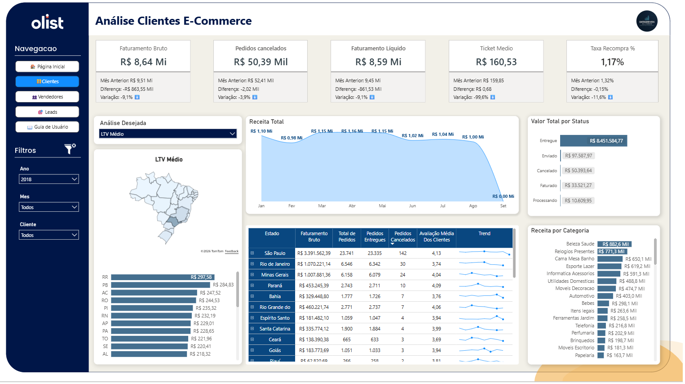
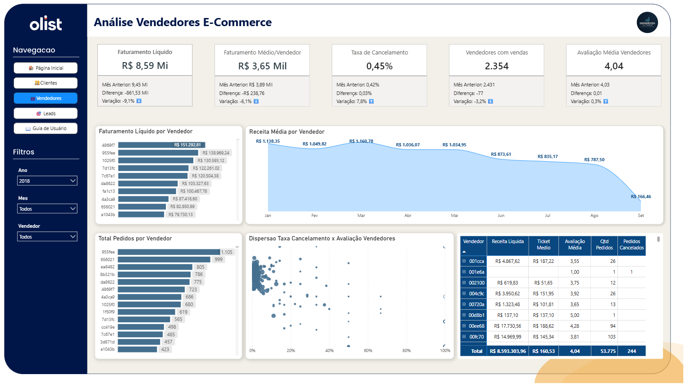

# 🛒 Olist Intelligence | E-commerce Performance Analytics


> **End-to-end Data Analytics solution for one of Brazil's largest marketplaces, focusing on LTV (Life Time Value), logistics performance, and seller analysis.**

---

## 📌 Contexto e Objetivos (Business Problem)
A Olist Store conecta milhares de vendedores a consumidores em todo o país. Apesar do alto volume de vendas, a empresa enfrentava desafios críticos na gestão de dados descentralizados, resultando em falta de clareza sobre o comportamento dos clientes (LTV), dificuldade em mensurar o impacto financeiro de atrasos logísticos e ausência de indicadores consolidados de performance dos vendedores.

O objetivo do projeto **Olist Intelligence** foi integrar, higienizar e analisar essas bases complexas para construir um ecossistema analítico que permitisse uma gestão *Data-Driven*.

---

## ⚙️ Arquitetura da Solução e ETL (Architecture)
O projeto destacou-se pela complexidade no tratamento e relacionamento de múltiplas fontes de dados independentes:

1. **Extração e Integração (ETL):** Padronização completa das bases de dados brutas (tratamento de CEPs, limpeza de textos inconsistentes, remoção de duplicidades e formatação de datas).
2. **Modelagem de Dados:** Construção de uma arquitetura *Star Schema* de alta performance para relacionar Pedidos, Pagamentos, Avaliações (Reviews), Produtos e Vendedores.
3. **Métricas Avançadas (DAX):** Desenvolvimento de KPIs estratégicos, incluindo *Customer Lifetime Value (LTV)*, Tempo Médio de Recompra, Taxa de Cancelamento e Custo de Perda Logística.
4. **UI/UX Design:** Prototipagem visual no Figma focada em redução de carga cognitiva para os tomadores de decisão.

---

## 📊 Destaques Visuais (Dashboard Previews)

*(Adicione as imagens do painel na pasta assets e ajuste os nomes abaixo se necessário)*

### 1. Visão Geral e Performance de Vendas


### 2. Análise de Logística e Satisfação (Review Score)


---

## 💡 Principais Insights Gerados (Key Findings)

* **O Impacto do Prazo na Reputação:** Foi comprovada uma correlação direta e severa entre o tempo de entrega e a avaliação do cliente (Review Score). Atrasos milimétricos demonstraram um impacto desproporcional na queda de reputação da plataforma.
* **Concentração de Risco Comercial:** A análise de Pareto (Curva ABC) revelou que um grupo extremamente reduzido de vendedores responde por grande parte do faturamento total, indicando uma necessidade urgente de diversificação e mitigação de riscos operacionais.
* **Validação de Funil de Marketing:** Vendedores recém-adquiridos por meio de canais específicos de *Leads* demonstraram performance de vendas superior, validando o ROI das campanhas de aquisição.

---

## 📁 Estrutura do Repositório

```text
📦 olist-ecommerce-analytics
 ┣ 📂 assets/                 # Imagens, wireframes e protótipos UI
 ┣ 📂 docs/                   # Documentação técnica e relatórios
 ┣ 📂 power_bi/               # Arquivo principal do Dashboard (.pbix)
 ┣ 📂 sql_scripts/            # Queries utilizadas na exploração dos dados
 ┗ 📜 README.md               # Apresentação do projeto

👨‍💻 Autor
Wilderson "Will" Pinto | Business Intelligence & Data Analytics

💼 Meu Portfólio Completo (Notion)

🔗 Meu LinkedIn
